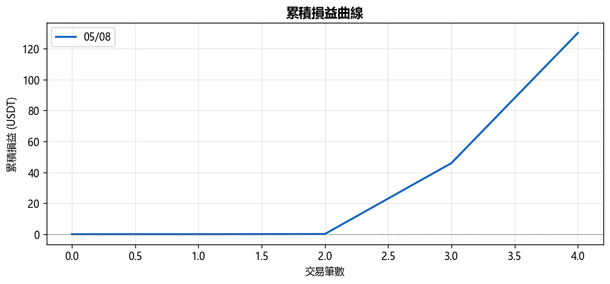
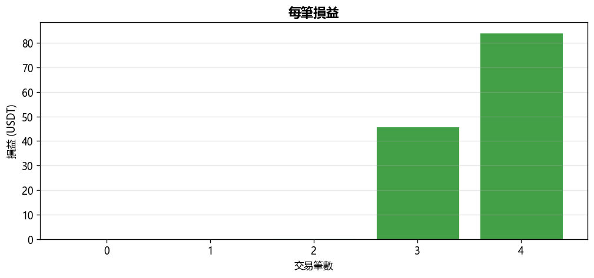
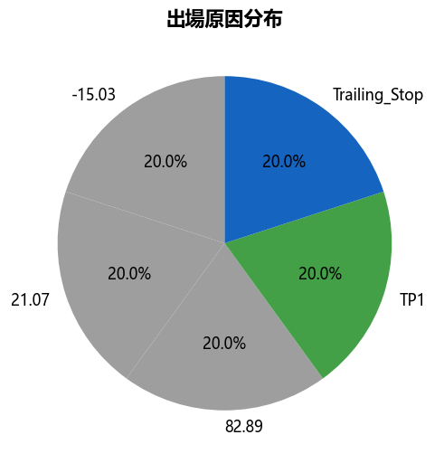
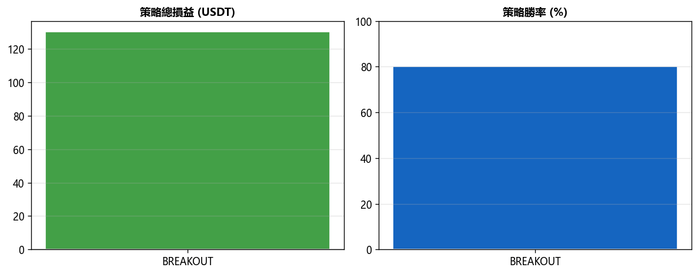

# [TEST] Daily Report 2026-05-08

## 總覽對比（05/07 → 05/08）

| 指標 | 上期 | 當期 | 變化 |
|------|------|------|------|
| 總損益 (USDT) | +$0.00 | +$130.22 | ▲$130.22 |
| 總損益 (%) | +0.00% | +2.60% | ▲2.60% |
| 勝率 | 0.0% | 80.0% | ▲80.00% |
| 總筆數 | 0 | 5 | +5 |
| 獲利筆數 | 0 | 4 | +4 |
| 虧損筆數 | 0 | 0 | +0 |
| 平手筆數 | 0 | 1 | +1 |
| 最佳單筆 | +$0.00 (-) | +$84.21 (币安人生/USDT) | - |
| 最差單筆 | +$0.00 (-) | +$0.00 (ARB/USDT) | - |
| 平均持倉時間 | - | 1h 36m | - |

## 策略表現

| 策略 | 筆數 | 損益 (USDT) | 勝率 |
|------|------|------------|------|
| BREAKOUT | 5 | +$130.22 | 80.0% |

## 出場原因分布

| 原因 | 筆數 | 佔比 |
|------|------|------|
| -15.03 | 1 | 20.0% |
| 21.07 | 1 | 20.0% |
| 82.89 | 1 | 20.0% |
| TP1 | 1 | 20.0% |
| Trailing_Stop | 1 | 20.0% |

## 圖表

---
*生成時間：2026-05-09 15:39:53 (台灣時間)*