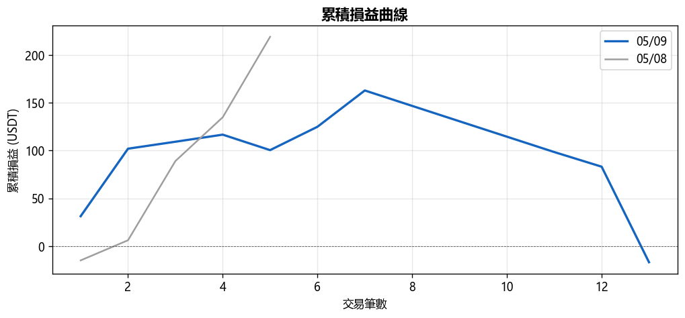
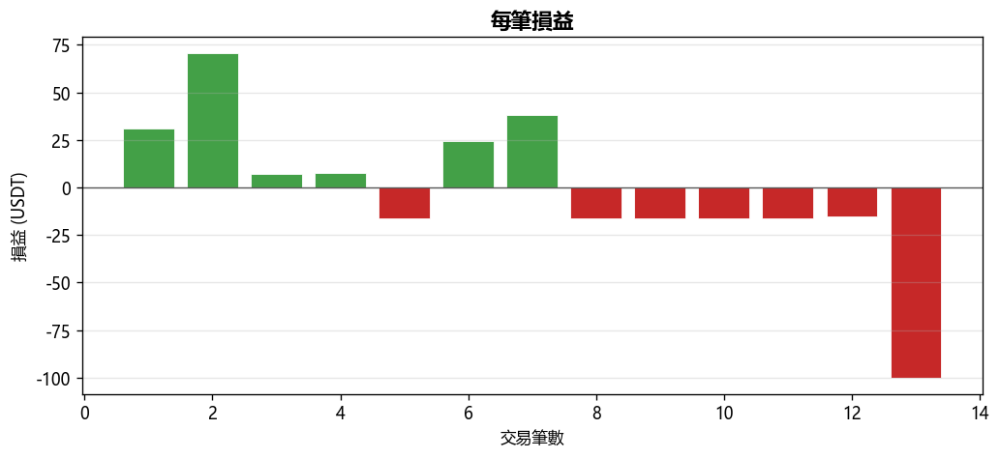
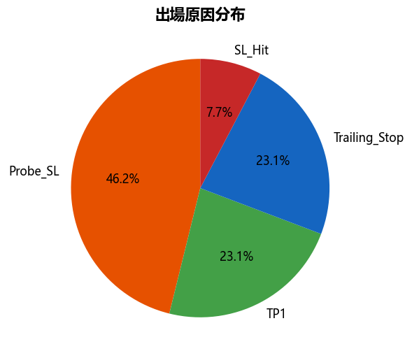
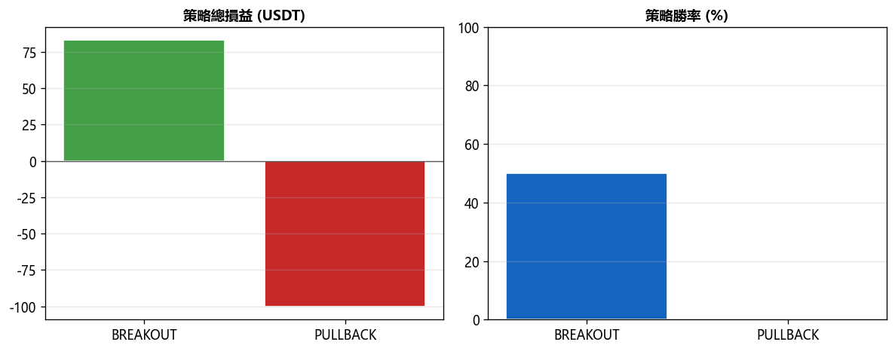

# 📊 每日報告 2026-05-09

## 總覽對比（05/08 → 05/09）

| 指標 | 上期 | 當期 | 變化 |
|------|------|------|------|
| 總損益 (USDT) | +$218.99 | $-16.96 | ▼$235.95 |
| 總損益 (%) | +4.38% | -0.34% | ▼4.72% |
| 勝率 | 80.0% | 46.2% | ▼33.85% |
| 總筆數 | 5 | 13 | +8 |
| 獲利筆數 | 4 | 6 | +2 |
| 虧損筆數 | 1 | 7 | +6 |
| 平手筆數 | 0 | 0 | +0 |
| 最佳單筆 | +$84.21 (币安人生/USDT) | +$70.68 (ALGO/USDT) | - |
| 最差單筆 | $-15.03 (SPK/USDT) | $-100.00 (RIVER/USDT) | - |
| 平均持倉時間 | 1h 36m | 5h 40m | - |

## 策略表現

| 策略 | 筆數 | 損益 (USDT) | 勝率 |
|------|------|------------|------|
| BREAKOUT | 12 | +$83.04 | 50.0% |
| PULLBACK | 1 | $-100.00 | 0.0% |

## 出場原因分布

| 原因 | 筆數 | 佔比 |
|------|------|------|
| Probe_SL | 6 | 46.2% |
| SL_Hit | 1 | 7.7% |
| TP1 | 3 | 23.1% |
| Trailing_Stop | 3 | 23.1% |

## 圖表

---
*生成時間：2026-05-10 08:00:11 (台灣時間)*