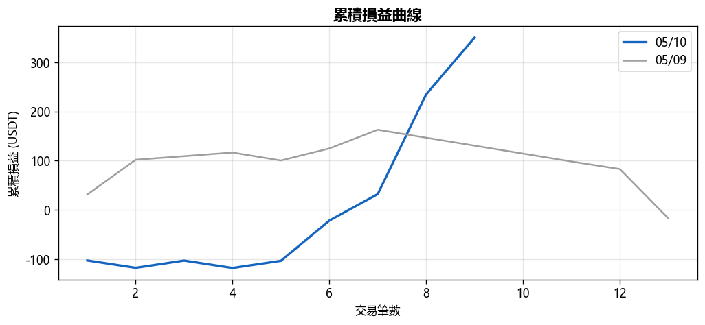
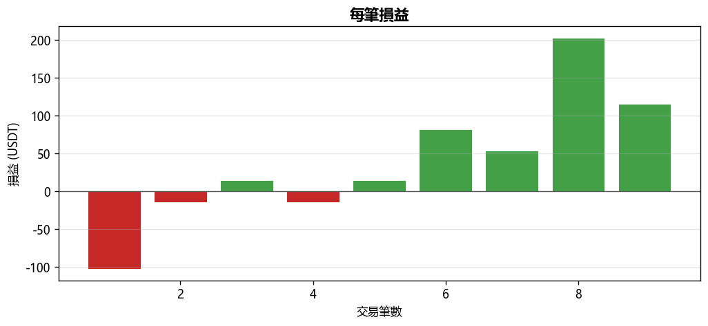
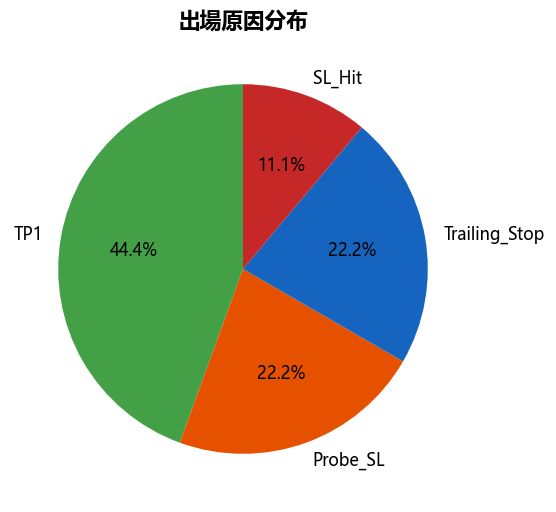
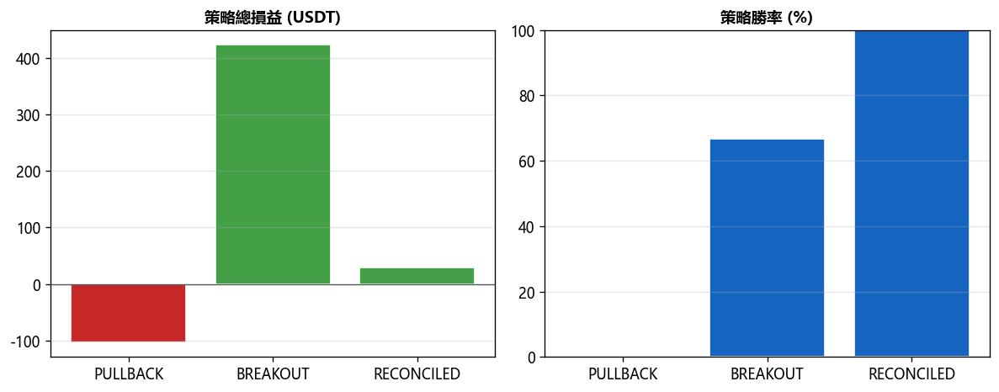

# 📊 每日報告 2026-05-10

## 總覽對比（05/09 → 05/10）

| 指標 | 上期 | 當期 | 變化 |
|------|------|------|------|
| 總損益 (USDT) | $-16.96 | +$349.95 | ▲$366.91 |
| 總損益 (%) | -0.34% | +7.00% | ▲7.34% |
| 勝率 | 46.2% | 66.7% | ▲20.51% |
| 總筆數 | 13 | 9 | -4 |
| 獲利筆數 | 6 | 6 | +0 |
| 虧損筆數 | 7 | 3 | -4 |
| 平手筆數 | 0 | 0 | +0 |
| 最佳單筆 | +$70.68 (ALGO/USDT) | +$202.63 (S/USDT) | - |
| 最差單筆 | $-100.00 (RIVER/USDT) | $-102.67 (B/USDT) | - |
| 平均持倉時間 | 5h 40m | 15h 9m | - |

## 策略表現

| 策略 | 筆數 | 損益 (USDT) | 勝率 |
|------|------|------------|------|
| BREAKOUT | 6 | +$423.28 | 66.7% |
| PULLBACK | 1 | $-102.67 | 0.0% |
| RECONCILED | 2 | +$29.34 | 100.0% |

## 出場原因分布

| 原因 | 筆數 | 佔比 |
|------|------|------|
| Probe_SL | 2 | 22.2% |
| SL_Hit | 1 | 11.1% |
| TP1 | 4 | 44.4% |
| Trailing_Stop | 2 | 22.2% |

## 圖表

---
*生成時間：2026-05-11 08:00:11 (台灣時間)*