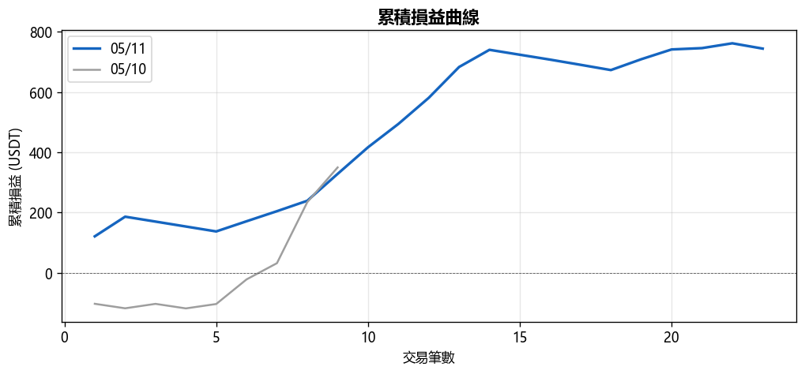
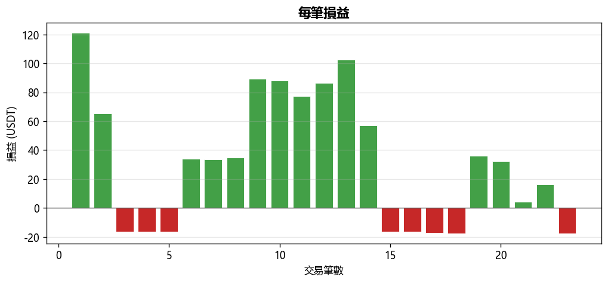
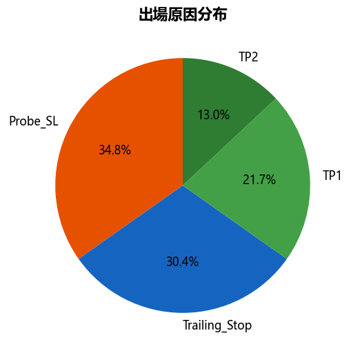
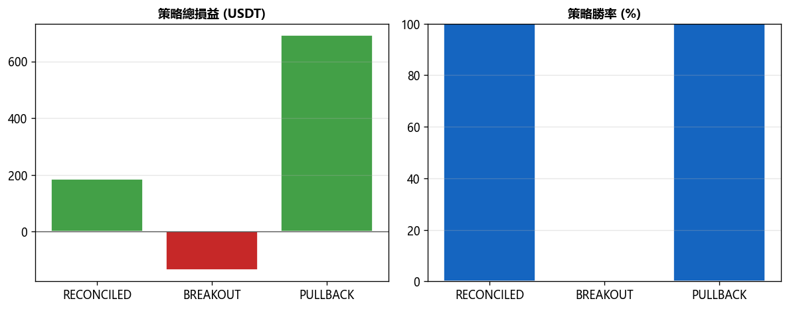

# 📊 每日報告 2026-05-11

## 總覽對比（05/10 → 05/11）

| 指標 | 上期 | 當期 | 變化 |
|------|------|------|------|
| 總損益 (USDT) | +$349.95 | +$744.23 | ▲$394.28 |
| 總損益 (%) | +7.00% | +14.88% | ▲7.89% |
| 勝率 | 66.7% | 65.2% | ▼1.45% |
| 總筆數 | 9 | 23 | +14 |
| 獲利筆數 | 6 | 15 | +9 |
| 虧損筆數 | 3 | 8 | +5 |
| 平手筆數 | 0 | 0 | +0 |
| 最佳單筆 | +$202.63 (S/USDT) | +$121.17 (HBAR/USDT) | - |
| 最差單筆 | $-102.67 (B/USDT) | $-17.64 (1000LUNC/USDT) | - |
| 平均持倉時間 | 15h 9m | 3h 16m | - |

## 策略表現

| 策略 | 筆數 | 損益 (USDT) | 勝率 |
|------|------|------------|------|
| BREAKOUT | 8 | $-133.85 | 0.0% |
| PULLBACK | 13 | +$691.68 | 100.0% |
| RECONCILED | 2 | +$186.40 | 100.0% |

## 出場原因分布

| 原因 | 筆數 | 佔比 |
|------|------|------|
| Probe_SL | 8 | 34.8% |
| SL_Hit | 0 | 0.0% |
| TP1 | 5 | 21.7% |
| TP2 | 3 | 13.0% |
| Trailing_Stop | 7 | 30.4% |

## 圖表

---
*生成時間：2026-05-12 08:00:11 (台灣時間)*