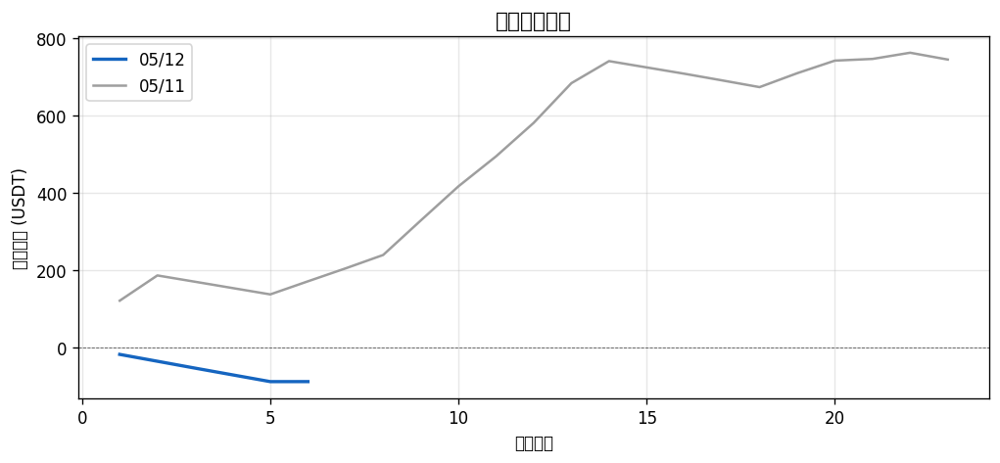
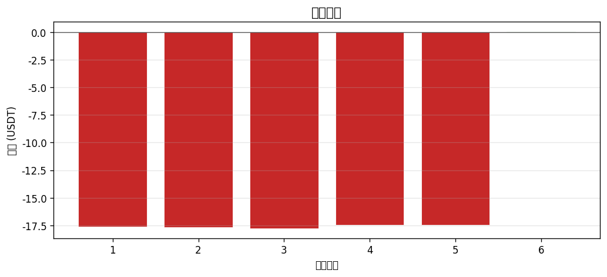
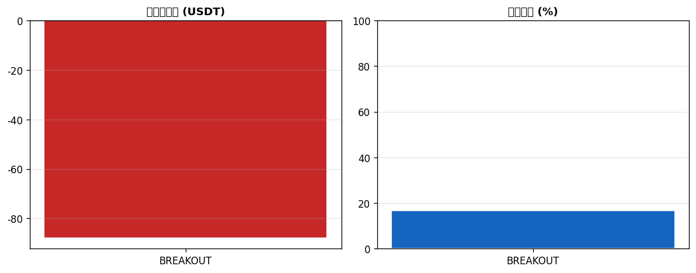

# 📊 每日報告 2026-05-12

## 總覽對比（05/11 → 05/12）

| 指標 | 上期 | 當期 | 變化 |
|------|------|------|------|
| 總損益 (USDT) | +$744.23 | $-87.89 | ▼$832.12 |
| 總損益 (%) | +372.12% | -43.95% | ▼416.06% |
| 勝率 | 65.2% | 16.7% | ▼48.55% |
| 總筆數 | 23 | 6 | -17 |
| 獲利筆數 | 15 | 1 | -14 |
| 虧損筆數 | 8 | 5 | -3 |
| 平手筆數 | 0 | 0 | +0 |
| 最佳單筆 | +$121.17 (HBAR/USDT) | +$0.06 (THETA/USDT) | - |
| 最差單筆 | $-17.64 (1000LUNC/USDT) | $-17.77 (BRETT/USDT) | - |
| 平均持倉時間 | 3h 16m | 4h 2m | - |

## 策略表現

| 策略 | 筆數 | 損益 (USDT) | 勝率 |
|------|------|------------|------|
| BREAKOUT | 6 | $-87.89 | 16.7% |
| PULLBACK | 0 | +$0.00 | 0.0% |
| RECONCILED | 0 | +$0.00 | 0.0% |

## 出場原因分布

| 原因 | 筆數 | 佔比 |
|------|------|------|
| Probe_SL | 6 | 100.0% |
| TP1 | 0 | 0.0% |
| TP2 | 0 | 0.0% |
| Trailing_Stop | 0 | 0.0% |

## 圖表

---
*生成時間：2026-05-13 08:00:13 (台灣時間)*