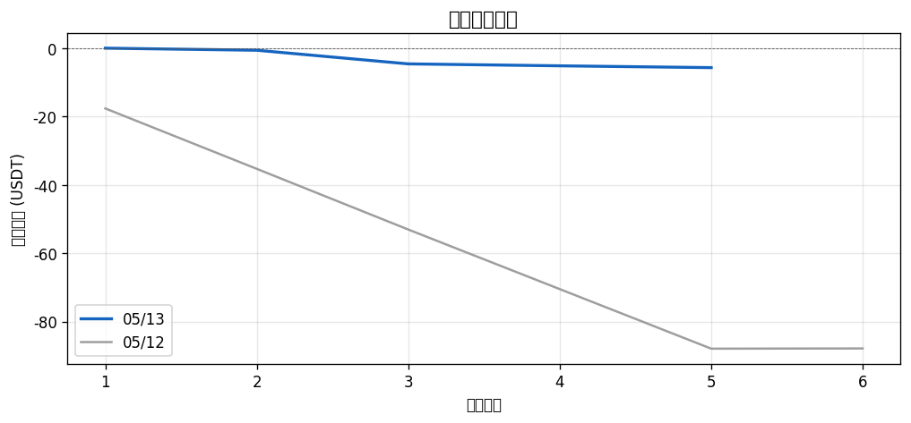
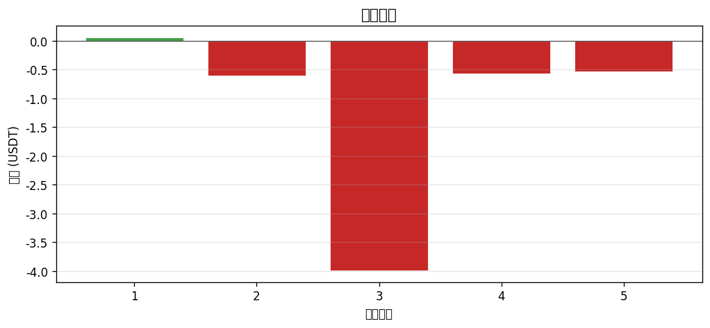
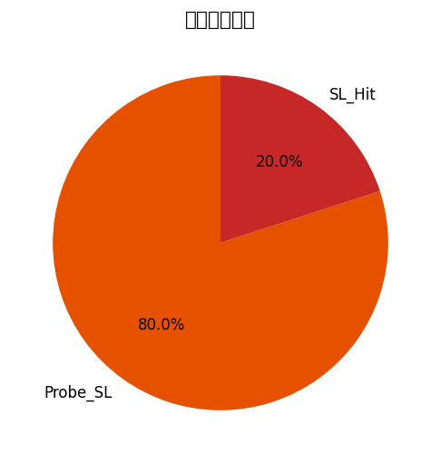
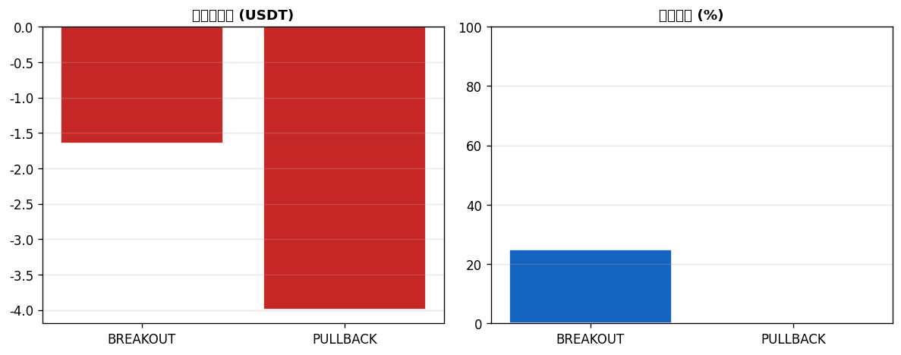

# 📊 每日報告 2026-05-13

## 總覽對比（05/12 → 05/13）

| 指標 | 上期 | 當期 | 變化 |
|------|------|------|------|
| 總損益 (USDT) | $-87.89 | $-5.64 | ▲$82.25 |
| 總損益 (%) | -43.95% | -2.82% | ▲41.12% |
| 勝率 | 16.7% | 20.0% | ▲3.33% |
| 總筆數 | 6 | 5 | -1 |
| 獲利筆數 | 1 | 1 | +0 |
| 虧損筆數 | 5 | 4 | -1 |
| 平手筆數 | 0 | 0 | +0 |
| 最佳單筆 | +$0.06 (THETA/USDT) | +$0.06 (API3/USDT) | - |
| 最差單筆 | $-17.77 (BRETT/USDT) | $-3.99 (IP/USDT) | - |
| 平均持倉時間 | 4h 2m | 1h 52m | - |

## 策略表現

| 策略 | 筆數 | 損益 (USDT) | 勝率 |
|------|------|------------|------|
| BREAKOUT | 4 | $-1.65 | 25.0% |
| PULLBACK | 1 | $-3.99 | 0.0% |

## 出場原因分布

| 原因 | 筆數 | 佔比 |
|------|------|------|
| Probe_SL | 4 | 80.0% |
| SL_Hit | 1 | 20.0% |

## 圖表

---
*生成時間：2026-05-14 08:00:15 (台灣時間)*