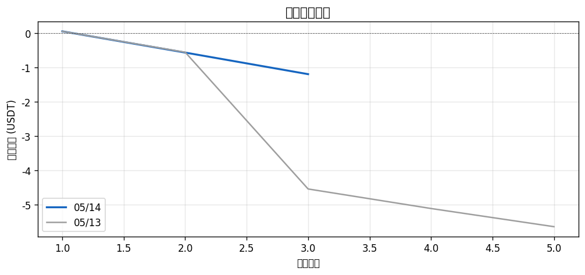
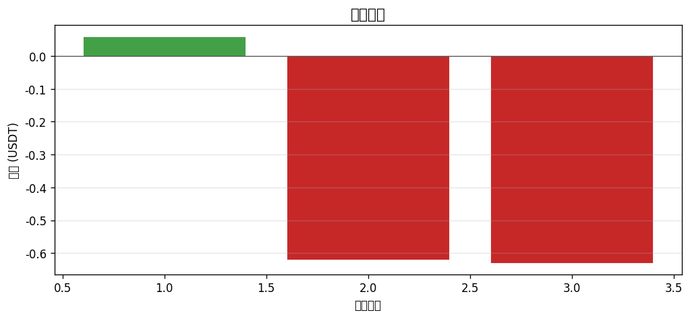
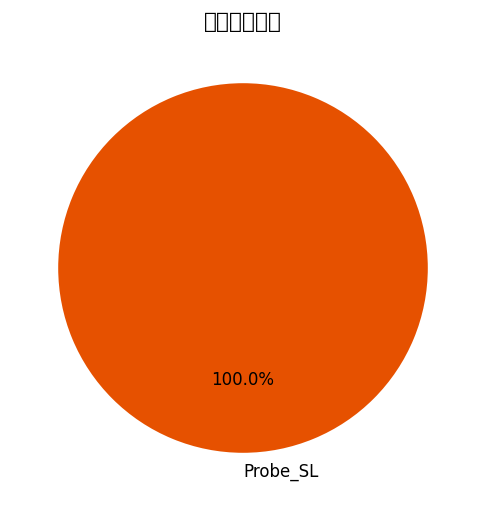
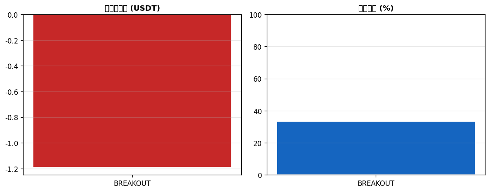

# 📊 每日報告 2026-05-14

## 總覽對比（05/13 → 05/14）

| 指標 | 上期 | 當期 | 變化 |
|------|------|------|------|
| 總損益 (USDT) | $-5.64 | $-1.19 | ▲$4.45 |
| 總損益 (%) | -2.82% | -0.59% | ▲2.23% |
| 勝率 | 20.0% | 33.3% | ▲13.33% |
| 總筆數 | 5 | 3 | -2 |
| 獲利筆數 | 1 | 1 | +0 |
| 虧損筆數 | 4 | 2 | -2 |
| 平手筆數 | 0 | 0 | +0 |
| 最佳單筆 | +$0.06 (API3/USDT) | +$0.06 (RIVER/USDT) | - |
| 最差單筆 | $-3.99 (IP/USDT) | $-0.63 (KITE/USDT) | - |
| 平均持倉時間 | 1h 52m | 2h 36m | - |

## 策略表現

| 策略 | 筆數 | 損益 (USDT) | 勝率 |
|------|------|------------|------|
| BREAKOUT | 3 | $-1.19 | 33.3% |
| PULLBACK | 0 | +$0.00 | 0.0% |

## 出場原因分布

| 原因 | 筆數 | 佔比 |
|------|------|------|
| Probe_SL | 3 | 100.0% |
| SL_Hit | 0 | 0.0% |

## 圖表

---
*生成時間：2026-05-15 08:00:13 (台灣時間)*