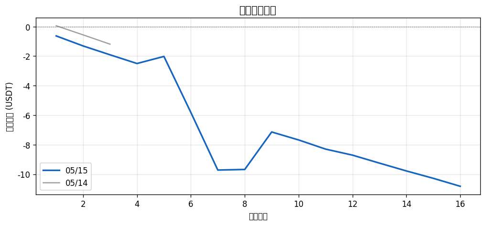
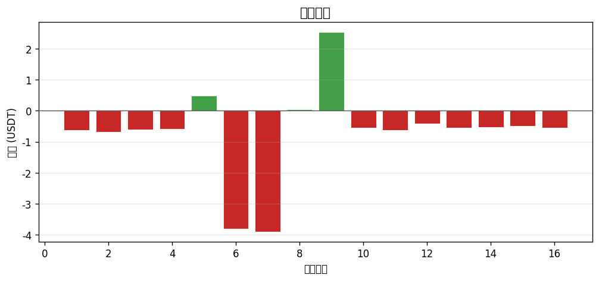
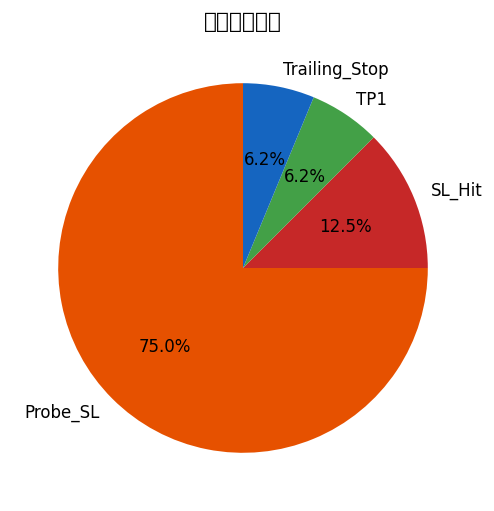
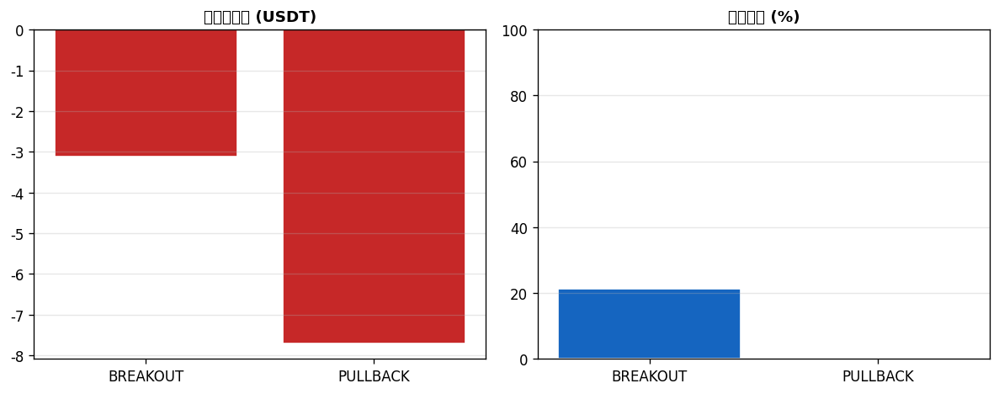

# 📊 每日報告 2026-05-15

## 總覽對比（05/14 → 05/15）

| 指標 | 上期 | 當期 | 變化 |
|------|------|------|------|
| 總損益 (USDT) | $-1.19 | $-10.82 | ▼$9.63 |
| 總損益 (%) | -0.59% | -5.41% | ▼4.82% |
| 勝率 | 33.3% | 18.8% | ▼14.58% |
| 總筆數 | 3 | 16 | +13 |
| 獲利筆數 | 1 | 3 | +2 |
| 虧損筆數 | 2 | 13 | +11 |
| 平手筆數 | 0 | 0 | +0 |
| 最佳單筆 | +$0.06 (RIVER/USDT) | +$2.54 (CGPT/USDT) | - |
| 最差單筆 | $-0.63 (KITE/USDT) | $-3.90 (XLM/USDT) | - |
| 平均持倉時間 | 2h 36m | 2h 14m | - |

## 策略表現

| 策略 | 筆數 | 損益 (USDT) | 勝率 |
|------|------|------------|------|
| BREAKOUT | 14 | $-3.12 | 21.4% |
| PULLBACK | 2 | $-7.70 | 0.0% |

## 出場原因分布

| 原因 | 筆數 | 佔比 |
|------|------|------|
| Probe_SL | 12 | 75.0% |
| SL_Hit | 2 | 12.5% |
| TP1 | 1 | 6.2% |
| Trailing_Stop | 1 | 6.2% |

## 圖表

---
*生成時間：2026-05-16 08:00:12 (台灣時間)*