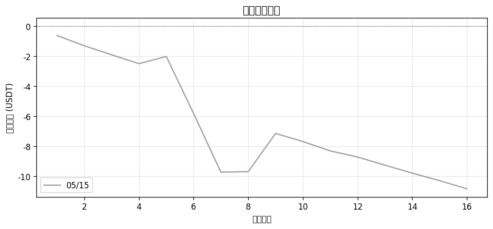
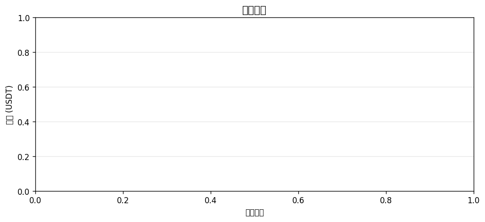
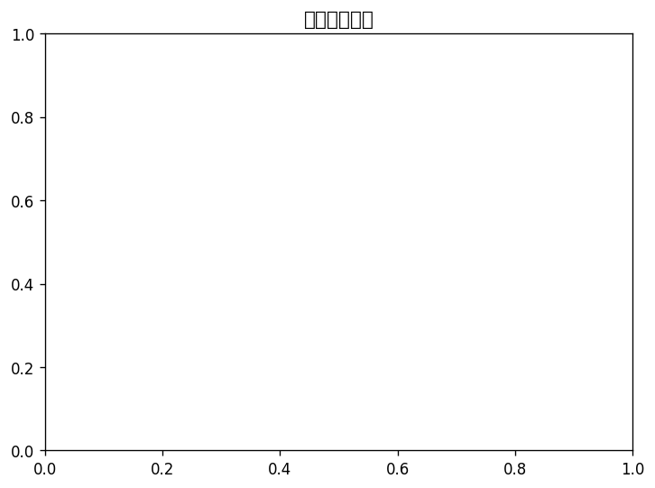
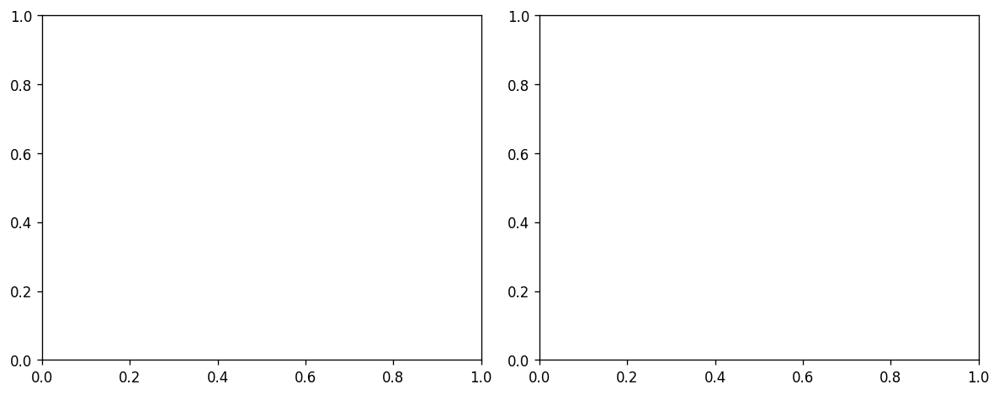

# 📊 每日報告 2026-05-16

## 總覽對比（05/15 → 05/16）

| 指標 | 上期 | 當期 | 變化 |
|------|------|------|------|
| 總損益 (USDT) | $-10.82 | +$0.00 | ▲$10.82 |
| 總損益 (%) | -5.41% | +0.00% | ▲5.41% |
| 勝率 | 18.8% | 0.0% | ▼18.75% |
| 總筆數 | 16 | 0 | -16 |
| 獲利筆數 | 3 | 0 | -3 |
| 虧損筆數 | 13 | 0 | -13 |
| 平手筆數 | 0 | 0 | +0 |
| 最佳單筆 | +$2.54 (CGPT/USDT) | +$0.00 (-) | - |
| 最差單筆 | $-3.90 (XLM/USDT) | +$0.00 (-) | - |
| 平均持倉時間 | 2h 14m | - | - |

## 策略表現

| 策略 | 筆數 | 損益 (USDT) | 勝率 |
|------|------|------------|------|
| BREAKOUT | 0 | +$0.00 | 0.0% |
| PULLBACK | 0 | +$0.00 | 0.0% |

## 出場原因分布

| 原因 | 筆數 | 佔比 |
|------|------|------|
| Probe_SL | 0 | 0.0% |
| SL_Hit | 0 | 0.0% |
| TP1 | 0 | 0.0% |
| Trailing_Stop | 0 | 0.0% |

## 圖表

---
*生成時間：2026-05-17 08:00:11 (台灣時間)*