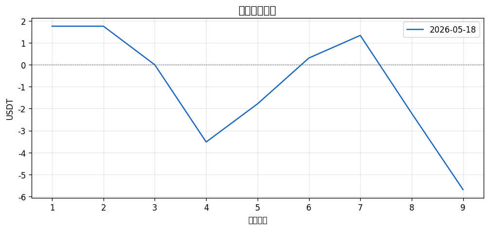
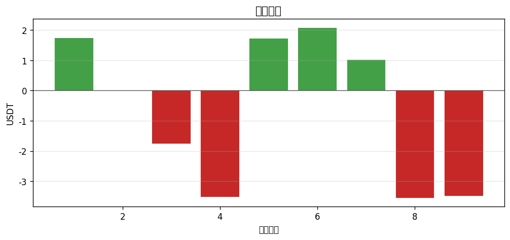

# 📊 每日報告 2026-05-18

## 總覽對比（2026-05-17 → 2026-05-18）

| 指標 | 前日 | 當日 | 變化 |
|------|------|------|------|
| 總損益 (USDT) | +$0.00 | $-5.69 | ▼5.69 |
| 總損益 (%) | +0.00% | -0.57% | ▼0.57 |
| 勝率 | 0.0% | 44.4% | ▲44.4 |
| 總筆數 | 0 | 9 | +9 |
| 最佳單筆 | +$0.00 (-) | +$2.09 (ROBO/USDT) | - |
| 最差單筆 | +$0.00 (-) | $-3.55 (ONDO/USDT) | - |

## 策略表現

| 策略 | 筆數 | 損益 | 勝率 |
|------|------|------|------|
| BREAKOUT | 3 | +$0.00 | 33.3% |
| PULLBACK | 6 | $-5.69 | 50.0% |

## 出場原因分布

| 原因 | 筆數 | 佔比 |
|------|------|------|
| BreakEven_SL | 1 | 11.1% |
| Initial_SL | 4 | 44.4% |
| TP1_50Pct | 2 | 22.2% |
| TP2_30Pct | 1 | 11.1% |
| Trailing_SL | 1 | 11.1% |

## 圖表

---
*生成時間：2026-05-19 08:00:09 (台灣時間)*