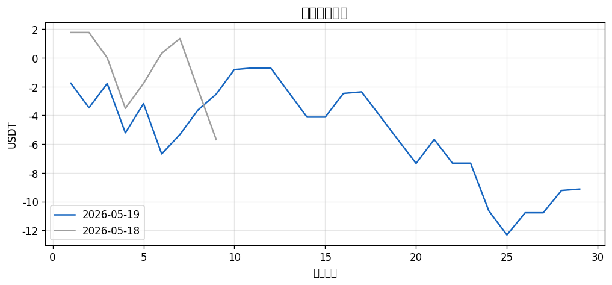
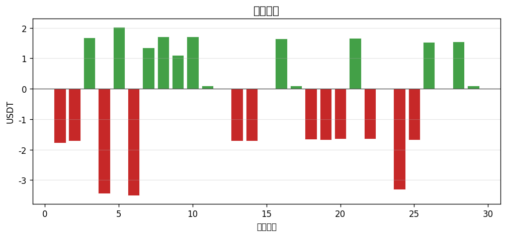

# 📊 每日報告 2026-05-19

## 總覽對比（2026-05-18 → 2026-05-19）

| 指標 | 前日 | 當日 | 變化 |
|------|------|------|------|
| 總損益 (USDT) | $-5.69 | $-9.13 | ▼3.44 |
| 總損益 (%) | -0.57% | -0.91% | ▼0.34 |
| 勝率 | 44.4% | 44.8% | ▲0.4 |
| 總筆數 | 9 | 29 | +20 |
| 最佳單筆 | +$2.09 (ROBO/USDT) | +$2.03 (WLFI/USDT) | - |
| 最差單筆 | $-3.55 (ONDO/USDT) | $-3.50 (MON/USDT) | - |

## 策略表現

| 策略 | 筆數 | 損益 | 勝率 |
|------|------|------|------|
| BREAKOUT | 17 | $-9.19 | 23.5% |
| PULLBACK | 12 | +$0.06 | 75.0% |

## 出場原因分布

| 原因 | 筆數 | 佔比 |
|------|------|------|
| BreakEven_SL | 7 | 24.1% |
| Initial_SL | 12 | 41.4% |
| TP1_50Pct | 8 | 27.6% |
| TP2_30Pct | 1 | 3.4% |
| Trailing_SL | 1 | 3.4% |

## 圖表

---
*生成時間：2026-05-20 08:00:08 (台灣時間)*