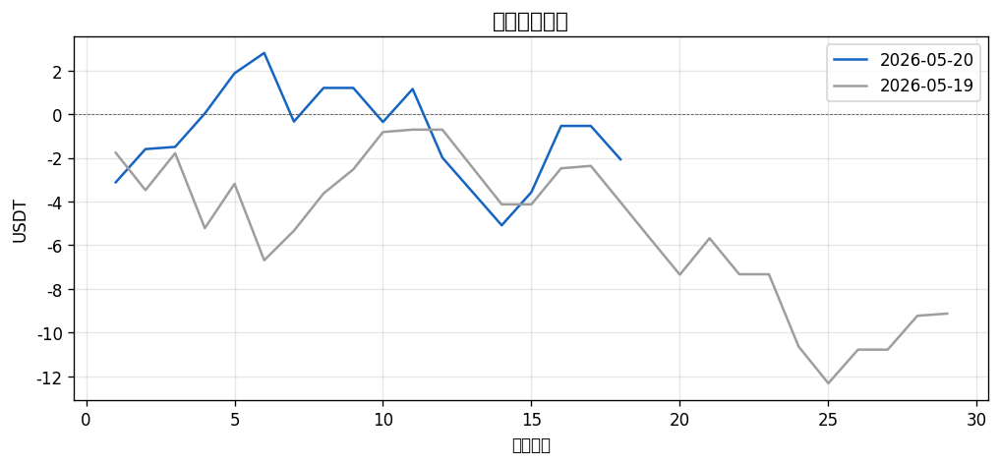
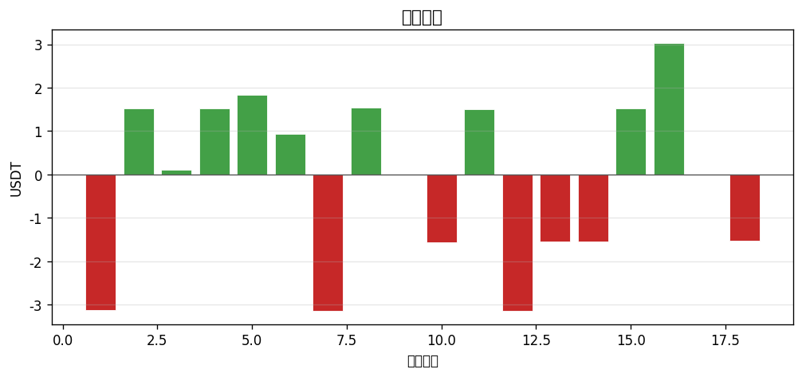

# 📊 每日報告 2026-05-20

## 總覽對比（2026-05-19 → 2026-05-20）

| 指標 | 前日 | 當日 | 變化 |
|------|------|------|------|
| 總損益 (USDT) | $-9.13 | $-2.07 | ▲7.06 |
| 總損益 (%) | -0.91% | -0.21% | ▲0.71 |
| 勝率 | 44.8% | 50.0% | ▲5.2 |
| 總筆數 | 29 | 18 | -11 |
| 最佳單筆 | +$2.03 (WLFI/USDT) | +$3.03 (NIL/USDT) | - |
| 最差單筆 | $-3.50 (MON/USDT) | $-3.14 (OP/USDT) | - |

## 策略表現

| 策略 | 筆數 | 損益 | 勝率 |
|------|------|------|------|
| BREAKOUT | 10 | +$1.41 | 40.0% |
| PULLBACK | 8 | $-3.48 | 62.5% |

## 出場原因分布

| 原因 | 筆數 | 佔比 |
|------|------|------|
| BreakEven_SL | 3 | 16.7% |
| Initial_SL | 7 | 38.9% |
| TP1_50Pct | 5 | 27.8% |
| TP2_30Pct | 1 | 5.6% |
| TP2_All | 1 | 5.6% |
| Trailing_SL | 1 | 5.6% |

## 圖表

---
*生成時間：2026-05-21 08:00:08 (台灣時間)*