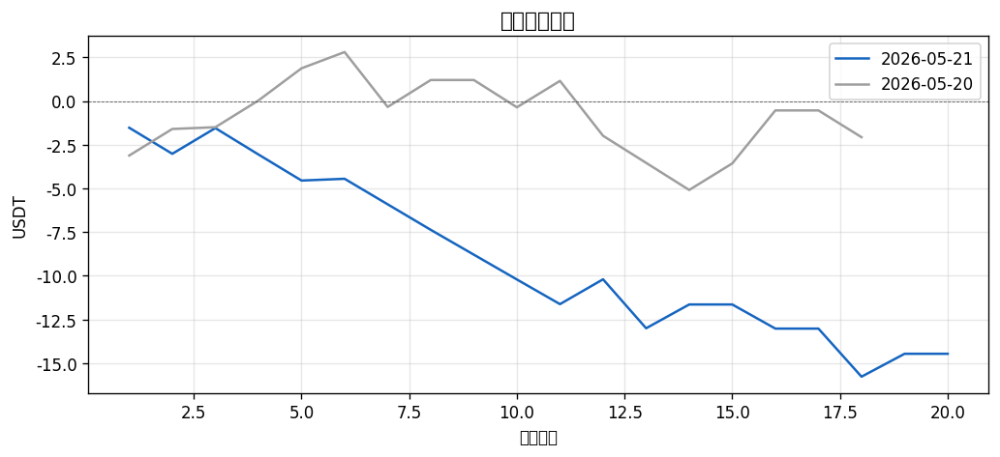
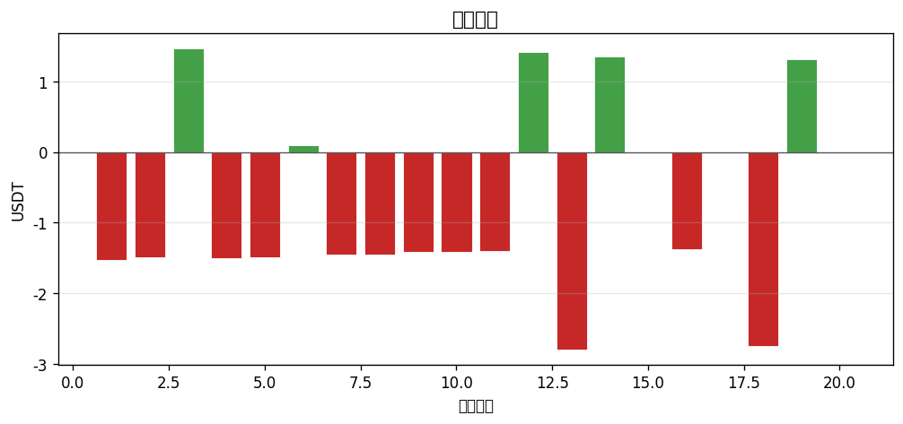

# 📊 每日報告 2026-05-21

## 總覽對比（2026-05-20 → 2026-05-21）

| 指標 | 前日 | 當日 | 變化 |
|------|------|------|------|
| 總損益 (USDT) | $-2.07 | $-14.46 | ▼12.39 |
| 總損益 (%) | -0.21% | -1.45% | ▼1.24 |
| 勝率 | 50.0% | 25.0% | ▼25.0 |
| 總筆數 | 18 | 20 | +2 |
| 最佳單筆 | +$3.03 (NIL/USDT) | +$1.47 (Q/USDT) | - |
| 最差單筆 | $-3.14 (OP/USDT) | $-2.80 (BIO/USDT) | - |

## 策略表現

| 策略 | 筆數 | 損益 | 勝率 |
|------|------|------|------|
| BREAKOUT | 16 | $-10.48 | 18.8% |
| PULLBACK | 4 | $-3.98 | 50.0% |

## 出場原因分布

| 原因 | 筆數 | 佔比 |
|------|------|------|
| BreakEven_SL | 4 | 20.0% |
| Initial_SL | 12 | 60.0% |
| TP1_50Pct | 4 | 20.0% |

## 圖表

---
*生成時間：2026-05-22 08:00:08 (台灣時間)*