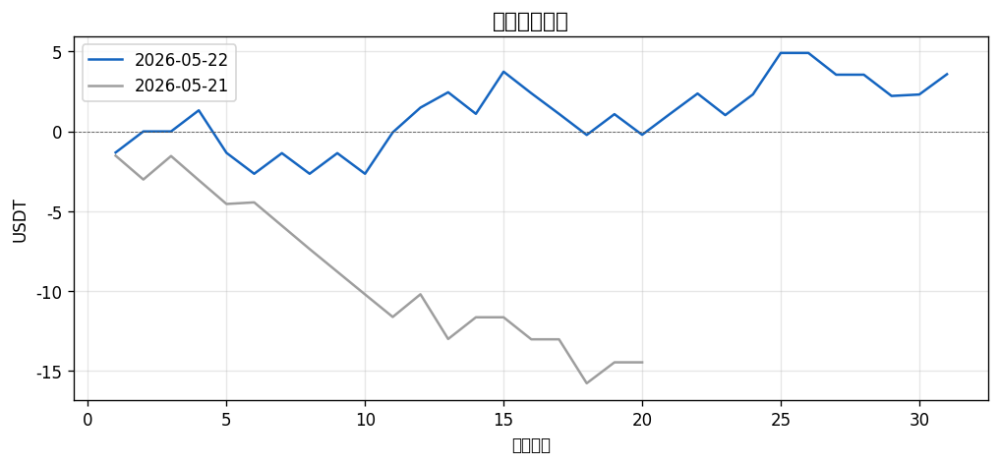
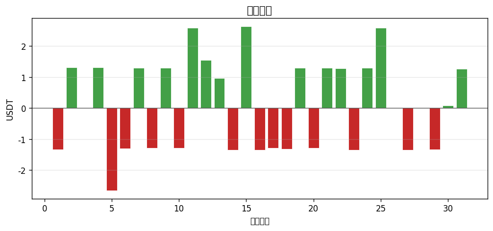

# 📊 每日報告 2026-05-22

## 總覽對比（2026-05-21 → 2026-05-22）

| 指標 | 前日 | 當日 | 變化 |
|------|------|------|------|
| 總損益 (USDT) | $-14.46 | +$3.57 | ▲18.03 |
| 總損益 (%) | -1.45% | +0.36% | ▲1.80 |
| 勝率 | 25.0% | 48.4% | ▲23.4 |
| 總筆數 | 20 | 31 | +11 |
| 最佳單筆 | +$1.47 (Q/USDT) | +$2.64 (ZAMA/USDT) | - |
| 最差單筆 | $-2.80 (BIO/USDT) | $-2.66 (FF/USDT) | - |

## 策略表現

| 策略 | 筆數 | 損益 | 勝率 |
|------|------|------|------|
| BREAKOUT | 24 | $-0.23 | 37.5% |
| PULLBACK | 7 | +$3.80 | 85.7% |

## 出場原因分布

| 原因 | 筆數 | 佔比 |
|------|------|------|
| BreakEven_SL | 4 | 12.9% |
| Initial_SL | 13 | 41.9% |
| TP1_50Pct | 9 | 29.0% |
| TP2_30Pct | 1 | 3.2% |
| TP2_All | 3 | 9.7% |
| Trailing_SL | 1 | 3.2% |

## 圖表

---
*生成時間：2026-05-23 08:00:10 (台灣時間)*