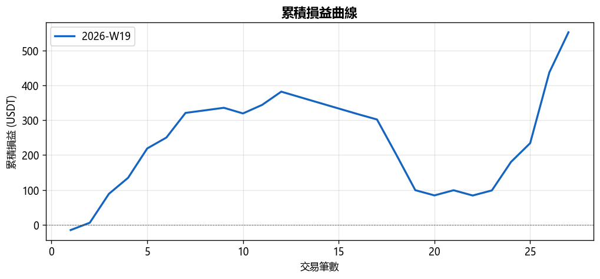
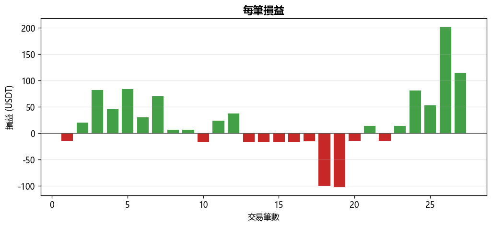
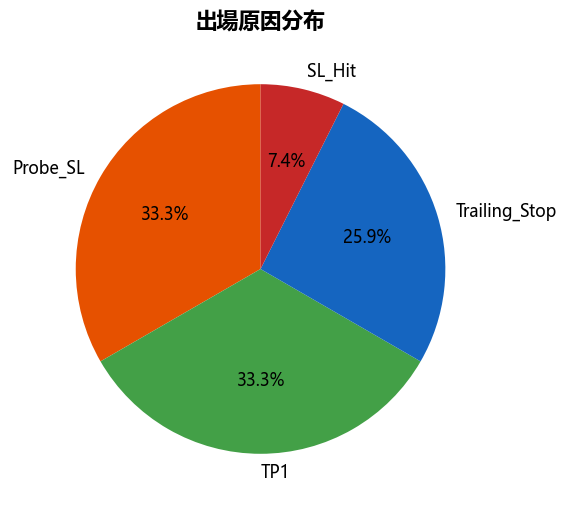
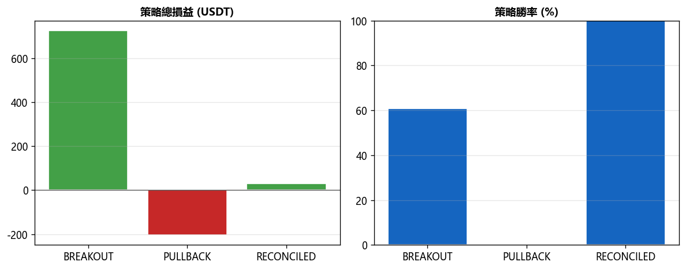

# 📊 週報 2026-W19

## 總覽對比（2026-W18 → 2026-W19）

| 指標 | 上期 | 當期 | 變化 |
|------|------|------|------|
| 總損益 (USDT) | +$0.00 | +$551.98 | ▲$551.98 |
| 總損益 (%) | +0.00% | +11.04% | ▲11.04% |
| 勝率 | 0.0% | 59.3% | ▲59.26% |
| 總筆數 | 0 | 27 | +27 |
| 獲利筆數 | 0 | 16 | +16 |
| 虧損筆數 | 0 | 11 | +11 |
| 平手筆數 | 0 | 0 | +0 |
| 最佳單筆 | +$0.00 (-) | +$202.63 (S/USDT) | - |
| 最差單筆 | +$0.00 (-) | $-102.67 (B/USDT) | - |
| 平均持倉時間 | - | 7h 35m | - |

## 策略表現

| 策略 | 筆數 | 損益 (USDT) | 勝率 |
|------|------|------------|------|
| BREAKOUT | 23 | +$725.31 | 60.9% |
| PULLBACK | 2 | $-202.67 | 0.0% |
| RECONCILED | 2 | +$29.34 | 100.0% |

## 出場原因分布

| 原因 | 筆數 | 佔比 |
|------|------|------|
| Probe_SL | 9 | 33.3% |
| SL_Hit | 2 | 7.4% |
| TP1 | 9 | 33.3% |
| Trailing_Stop | 7 | 25.9% |

## 圖表

---
*生成時間：2026-05-11 08:00:22 (台灣時間)*